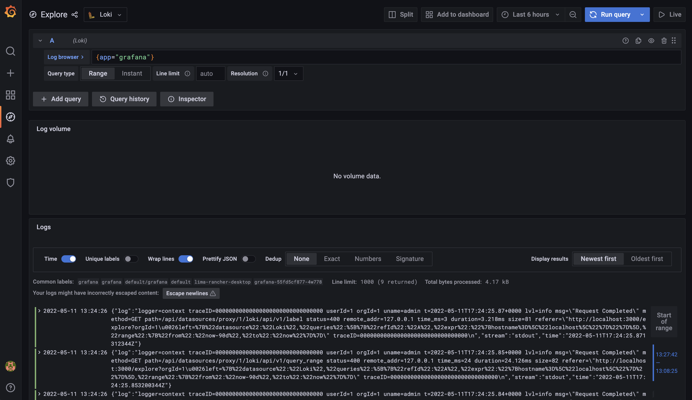

# Grafana Sample with Helm Chart

Grafana with Loki and Promtail and some other data sources

- **Loki**: horizontally-scalable, highly-available, multi-tenant log aggregation system inspired by Prometheus
- **Promtail**: agent which ships the contents of local logs to Loki



## Local Environment Setup

### Requirements

- Rancher Desktop (https://rancherdesktop.io/)
- Tilt (https://tilt.dev/)

### Quick Start on Local Machine

Configure `_scm_config/values.local.yaml`

```bash
# register helm repo
helm repo list
helm repo add grafana https://grafana.github.io/helm-charts
helm repo add elastic https://helm.elastic.co
helm repo add bitnami https://charts.bitnami.com/bitnami
helm repo update
# install dependencies
helm dep update ./charts
# start local k8s cluster
tilt up
# clean local k8s cluster
tilt down
```

### Grafana Dashboard

A sample dashboard is available, the imported json is located on `charts/dashboards/kubernetes.json`.

### Data Source

**Loki**

Loki collects system log sent by Promtail configured on `charts/values.yaml`.

**PostgreSQL**

Simple Data is stored at the initial launch configured on `charts/values.yaml`.

**Elasticsearch**

No data is stored at the initial launch.

### Notes

The default Grafana admin credentials are configurable on `charts/values.yaml`, however in case you cannot login you can change admin password with the following method: 

```bash
# get a pod name
kubectl get pod
# ssh to the pod
kubectl exec -it <pod_name> -- /bin/bash
# change grafana password
grafana-cli admin reset-admin-password admin
```